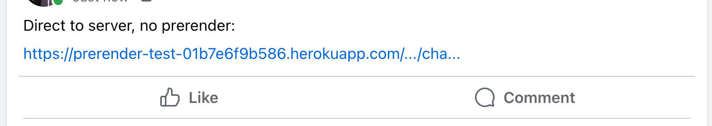

# Prerender-test

This repository contains a simple single-page react app deployed to Heroku (for no good reason[^1]) and fronted by a CDN use [Prerender.io](https://prerender.io) to create static HTML previews for bots.

[^1]: When deployed elsewhere, I either had trouble getting SPA routing to work (all paths serving index.html), or I had trouble getting Fastly CDN to read the origin correct. After finding Fastly's `Override Host` setting, I overcame the latter issue on Heroku. Possibly that would have worked elsewhere.

- Heroku App: https://prerender-test-01b7e6f9b586.herokuapp.com/
- CDN: https://christopher-chudzicki.global.ssl.fastly.net/

The app includes **dynamically generated metadata tags**: these tags are rendered by Javascript (through React) based on API data.

The app contains two routes:

- `/`: The homepage
  - no interesting metadata tags.
- `/pokemon/:name` which uses [PokeApi](https://pokeapi.co/) to fetch data.
  - Includes Opengraph metadata tags based on fetched data
  - `/pokemon/ditto` and `/pokemon/pikachu` are linked to from the homepage. Other pokemon routes work, but only these two are linked.

Social Media Previews:

| https://prerender-test-01b7e6f9b586.herokuapp.com/pokemon/charmander | https://christopher-chudzicki.global.ssl.fastly.net/pokemon/charmander |
| -------------------------------------------------------------------- | ---------------------------------------------------------------------- |
| no prerender                                                         | with prerender                                                         |
|           |                   |

## Development

With [corepack enabled](https://github.com/nodejs/corepack#corepack-enable--name):

- `yarn install` installs dependencies
- `yarn dev` starts the server in development mode
- `yarn build` builds the SPA for production
- `yarn start` serves the SPA with a NodeJS express server
